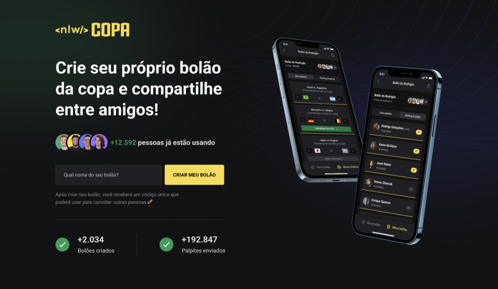
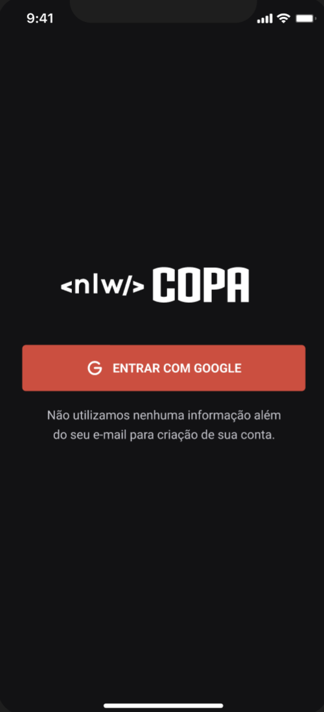
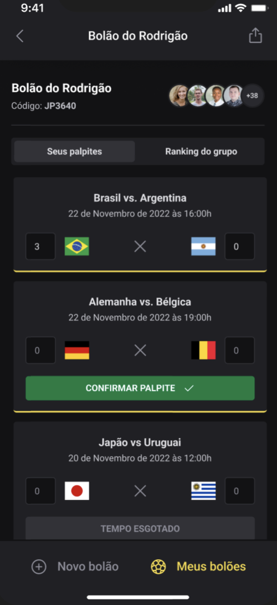

<h4 align="center">
  
</h4>

<p align="center">
  <em>
    Node
    · TypeScript
    · Fastify
    · Prisma
    · Zod
  </em>
  <br />
  <em>
    React
    · Next.js
    · Typescript
    · Tailwindcss
  </em>
  <br />
  <em>
    React Native
    · Expo
    · Typescript
    · Native Base
    · Google auth
  </em>
  <br />
  <em>
    Figma
    · Git
  </em>
</p>

## Project

O NLW Copa foi realizado durante o evendo NLW 10, da Rocketseat. Consiste em uma aplicação para criar bolões dos jogos da copa do mundo.

Protótipos do projeto:  [Figma](https://www.figma.com/community/file/1169028343875283461)



<br>




<br>


## Setup

**Necessário:**

Node 18
<br>

**Backend:**
Crie um arquivo `.env` com o seguinte conteudo para apontar o arquivo do banco de dados:

```bash
DATABASE_URL="file:./dev.db"
```

Rodar o projeto:
```bash
$ cd server
$ npm i && npm run migrate && npm run seed && npm run dev
```

<br>

**Frontend:**
```bash
$ cd web
$ npm i && npm run dev
```

<br>

**Mobile:**
```bash
$ cd mobile
$ npm i && npm start
```

crie um arquivo `.env` com o seu client id do google:

```bash
CLIENT_ID="asdada"
```

Criar um Client OAuth ([http://console.cloud.google.com/](http://console.cloud.google.com/))

<br>

**Celular físico**
Instale o aplication **Expo Go** e leia o QRCode gerado no terminal

**Simulador**

```bash
$ npm run ios
$ npm run android
```

### API:

Importe todas as requisições no Insomnia: [project collection.](./server//Insomnia_collection.json)